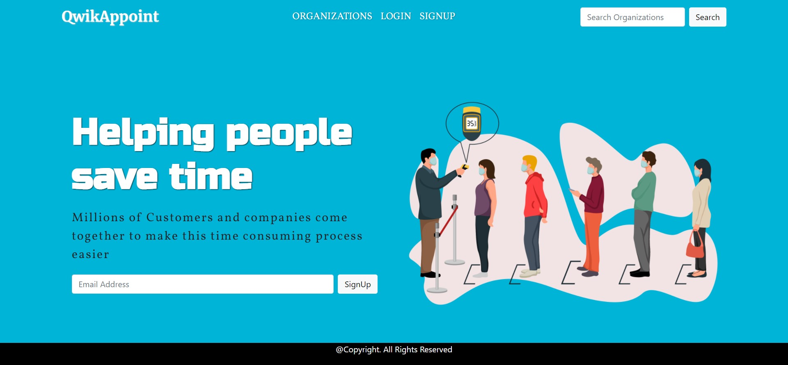

# QwikAppoint

QwikAppoint is a website where people can take appointment from Doctors or any medical organization. It is made with the purpose that we end up wasting a lot of time waiting in queue for our medical CheckUp. QwikAppoint will send notifications to the person when thier appointment time is arrived. By doing this, they will be able to save thier time and meet with the doctors easily.




## Tech Stack Used
- Python3.7
- Django
- HTML, CSS & JavaScript for Frontend

## Installation on Local Machine

Use the package manager [pip](https://pip.pypa.io/en/stable/) to setup this Django project.

```bash
pip install virtualenv

virtualenv myprojectenv

source myprojectenv/bin/activate

pip install -r requirements.txt

python manage.py makemigrations

python manage.py migrate

```